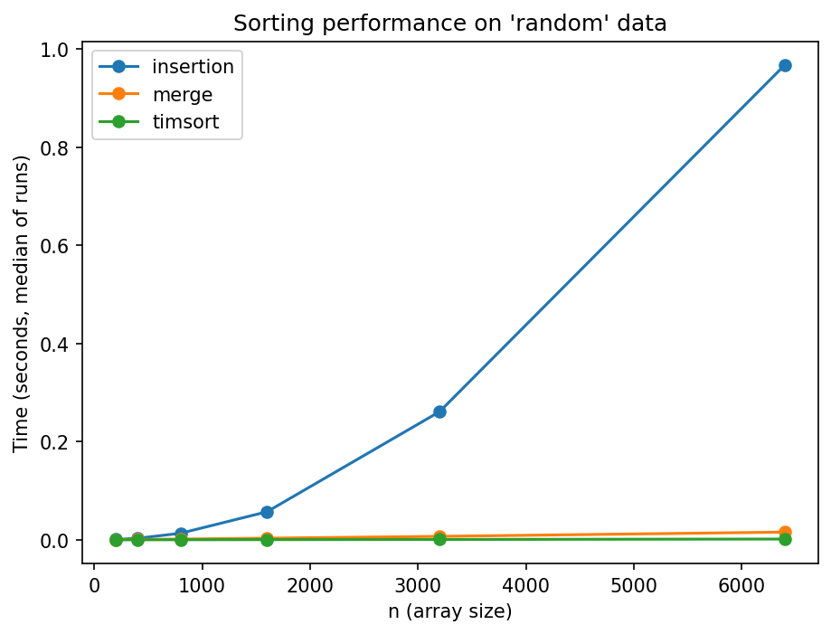
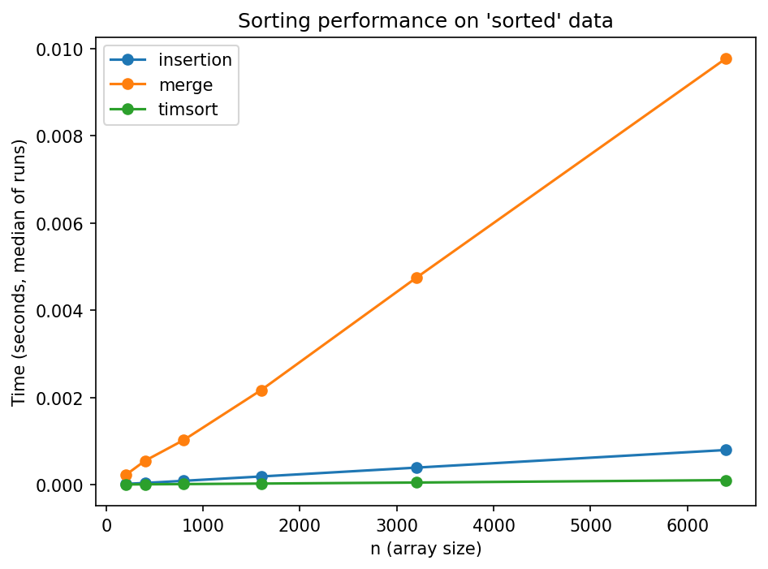
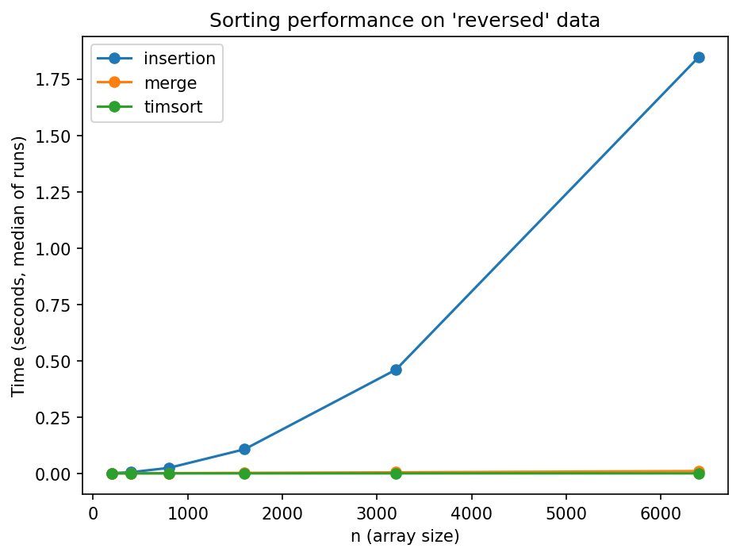
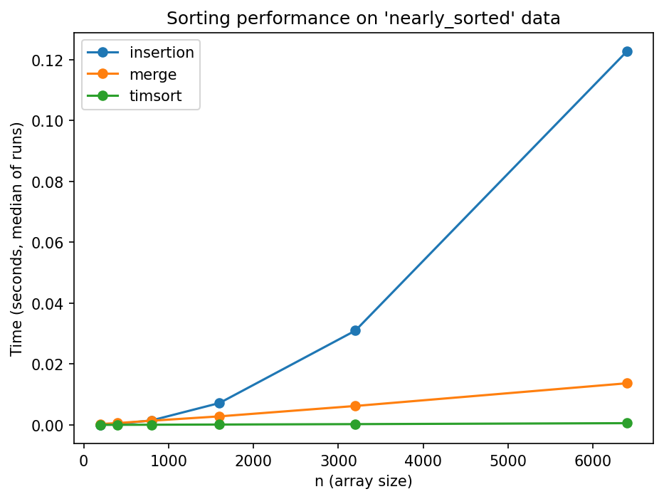

# Sorting Algorithms: Empirical Comparison (Merge vs Insertion vs Timsort)

Benchmark three sorting algorithms in Python using `timeit` across multiple input sizes and patterns.

**Algorithms:** Insertion Sort, Merge Sort, Timsort (`sorted`).

## Theoretical complexities (big-O)

- Insertion sort: **O(n²)** average/worst, **O(n)** best.

- Merge sort: **O(n log n)** in all cases.

- Timsort: **O(n log n)** worst/average, highly **adaptive** to existing runs.

## Key Findings

- **Overall fastest on average**: `timsort` (Python's `sorted`, i.e., Timsort).

- On **nearly sorted data**, Timsort remains best; insertion improves on small n but falls behind as n grows.

- **Merge sort** shows expected O(n log n) scaling and is competitive, but **Timsort** is typically faster due to exploiting existing runs and switching to insertion sort on small segments.

- **Insertion sort** exhibits O(n²) growth on random/reversed inputs and becomes impractical for large n.

## Plots

## Sample of Raw Results

| pattern       |    n | algorithm   |    time_sec |
|:--------------|-----:|:------------|------------:|
| nearly_sorted |  200 | insertion   | 6.9987e-05  |
| nearly_sorted |  200 | merge       | 0.000266085 |
| nearly_sorted |  200 | timsort     | 8.854e-06   |
| nearly_sorted |  400 | insertion   | 0.000327325 |
| nearly_sorted |  400 | merge       | 0.000605345 |
| nearly_sorted |  400 | timsort     | 1.9874e-05  |
| nearly_sorted |  800 | insertion   | 0.00146737  |
| nearly_sorted |  800 | merge       | 0.0013693   |
| nearly_sorted |  800 | timsort     | 4.8592e-05  |
| nearly_sorted | 1600 | insertion   | 0.00718553  |
| nearly_sorted | 1600 | merge       | 0.0028006   |
| nearly_sorted | 1600 | timsort     | 0.000112352 |
| nearly_sorted | 3200 | insertion   | 0.0309788   |
| nearly_sorted | 3200 | merge       | 0.00621449  |
| nearly_sorted | 3200 | timsort     | 0.00024779  |
| nearly_sorted | 6400 | insertion   | 0.122804    |
| nearly_sorted | 6400 | merge       | 0.0136766   |
| nearly_sorted | 6400 | timsort     | 0.000561322 |
| random        |  200 | insertion   | 0.000687736 |
| random        |  200 | merge       | 0.000495991 |